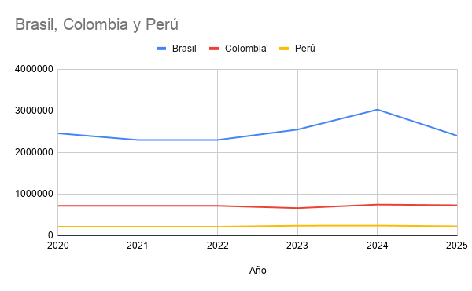

# Coffee Export Analysis in South America 2020-2025

## Overview
Analysis of coffee export volumes and trends for Brazil, Colombia and Peru from 2020 to 2025 using official export data.

## Key Findings
- Brazil remains the largest exporter with steady growth
- Colombia shows consistent quality-focused exports
- Peru has the fastest growth rate in the period

## Data Sources
Official data from ICO, USDA FAS, and national export agencies.
